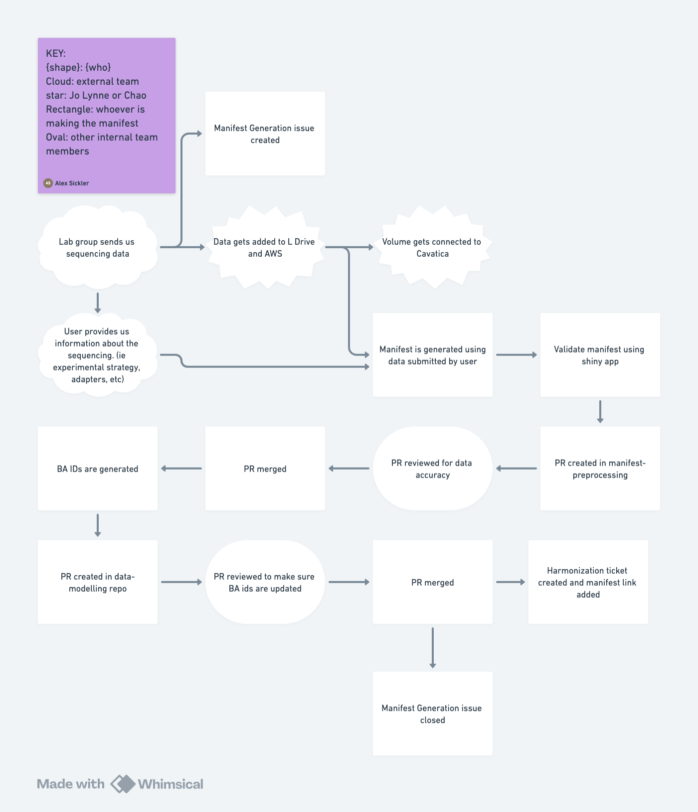

# manifest-template

This repo serves as the central location for manifest templates and the validation rules describing the required data and format for those data within manifests.

Validation rules are based on the rules established at Children's Hospital of Philadelphia Center for Data-Driven Discovery in Biomedicine and used in [their cli](https://github.com/d3b-center/d3b-dff-cli).

Any other repositories or workflows using the manifests or the validation rules should include this repository as a [git submodule](https://git-scm.com/book/en/v2/Git-Tools-Submodules).

An explanation of each column in the manifests, their explanations, and any required values can be found in the [docs folder](docs/).

## Manifest Creation Flowchart

