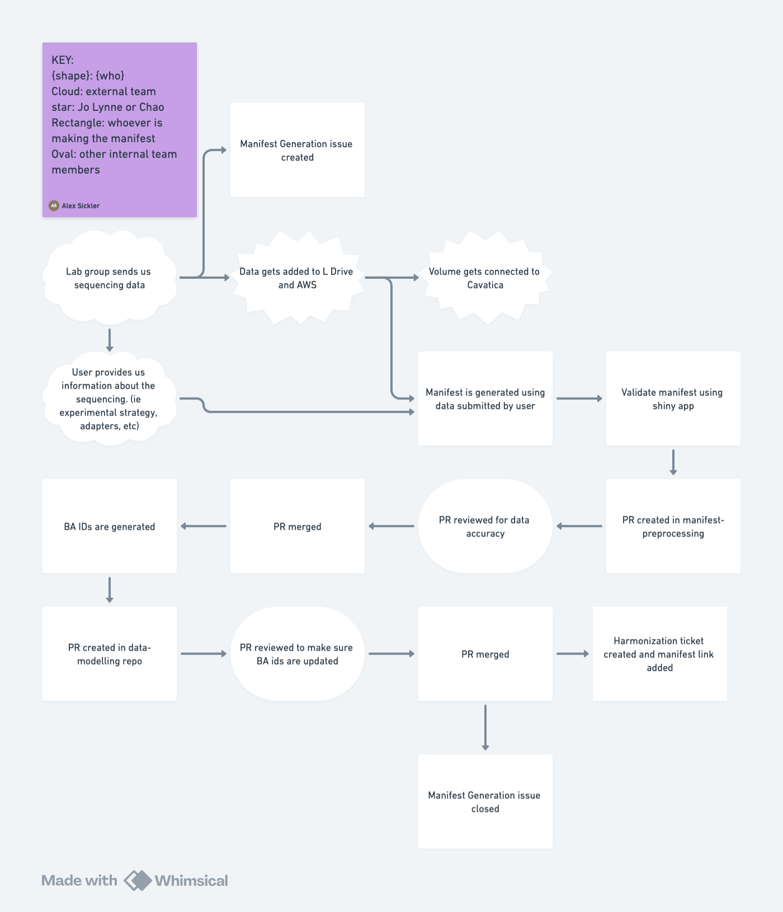

# Data Manifest Templates


**Central repository for data manifest templates and their validation rules**, maintained by the Brain Tumor Institute (BTI) Bioinformatics Core @ Children's National Hospital.

This repository defines the required structure, fields, and allowed values for each supported data manifest so that submissions can be generated and validated consistently across projects and tools.

The validation framework builds upon rules originally established at Children's Hospital of Philadelphia Center for Data-Driven Discovery in Biomedicine and used in [their CLI](https://github.com/d3b-center/d3b-dff-cli), with further extensions and enhancements introduced here.

---

## Contents

- [Repository Structure](#repository-structure)
- [Supported Manifest Types](#supported-manifest-types)
- [Validation Rules](#validation-rules)
- [Using This Repo](#using-this-repo)
- [Manifest Creation Flowchart](#manifest-creation-flowchart)
- [License](#license)

## Repository Structure

| Path | Description |
|---|---|
| [`validation_json/`](validation_json/) | The Cerberus validation schema (`validation_rules_schema.json`) that defines required fields, types, allowed values, and cross-field dependencies for every manifest type. |
| [`manifest_templates/`](manifest_templates/) | Blank CSV templates — one per manifest type — with the exact column headers expected by the validator. |
| [`docs/`](docs/) | Human-readable, per-manifest field documentation: what each column means, whether it's required, allowed values, data type, and an example entry. |
| [`assets/`](assets/) | Supporting diagrams, including the manifest creation flowchart below. |

## Supported Manifest Types

| Manifest | Template | Field Documentation |
|---|---|---|
| WGS / WXS / Targeted Panel | [CSV](manifest_templates/wgs_wxs_panel_manifest_template.csv) | [Docs](docs/wgs_wxs_panel_manifest_template.md) |
| RNAseq / miRNAseq | [CSV](manifest_templates/rnaseq_mirnaseq_manifest_template.csv) | [Docs](docs/rnaseq_mirnaseq_manifest_template.md) |
| Single Cell — CITE-Seq / BCR / TCR | [CSV](manifest_templates/single_cell_citeseq_bcrtcr_manifest_template.csv) | [Docs](docs/single_cell_citeseq_bcrtcr_manifest_template.md) |
| Single Cell — Spatial | [CSV](manifest_templates/single_cell_spatial_manifest_template.csv) | [Docs](docs/single_cell_spatial_manifest_template.md) |
| Methylation | [CSV](manifest_templates/methylation_manifest_template.csv) | [Docs](docs/methylation_manifest_template.md) |
| Proteomics | [CSV](manifest_templates/proteomics_manifest_template.csv) | [Docs](docs/proteomics_manifest_template.md) |

## Validation Rules

All validation logic lives in [`validation_json/validation_rules_schema.json`](validation_json/validation_rules_schema.json), written for the [Cerberus](https://docs.python-cerberus.org/) validation library. Rules are organized as:

- **`common_rules`** — fields shared across every manifest type (identifiers, file metadata, organism, etc.)
- **Type-specific rule sets** (`DNAseq_rules`, `RNAseq_rules`, `single_cell_rules`, `pacbio_longread_rules`, `methylation_rules`, `proteomics_rules`) — fields and constraints unique to that assay type, including conditional requirements (`dependencies`) based on values like `experimental_strategy` or `file_format`.

## Using This Repo

Any other repository or workflow that consumes these manifests or validation rules should include this repository as a [git submodule](https://git-scm.com/book/en/v2/Git-Tools-Submodules) rather than copying files directly, so downstream consumers stay in sync with schema updates:

```bash
git submodule add git@github.com:childrens-bti/manifest-template.git
```

## Manifest Creation Flowchart



## License

Distributed under the [BSD 2-Clause License](LICENSE).
